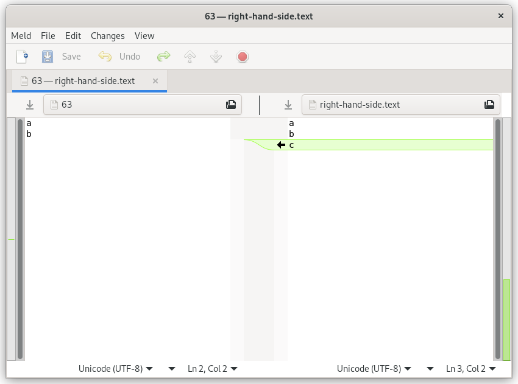

# 📋 cb

Command-line clipboard with automatic copy and paste detection. Eg,
`cb|sort|cb`.

## Purpose

Graphical and command-line interfaces (GUIs and CLIs) are each great but working
across them can be cumbersome. The system clipboard is a surprisingly convenient
mechanism to integrate the two. cb improves that integration by automatically
detecting whether a copy or paste is wanted for all major operating systems.
Most of this tool is documentation to demonstrate the many ways in which the
system clipboard can be used.

## Usage

Supply standard input to **copy**:

```console
$ echo abc|cb
```

Supply no input to **paste**:

```console
$ cb
abc
```

Both copy and paste can appear in the same command:

```console
$ curl "$(cb)"|cb
```

## Installation

```bash
# Download the script to ~/bin/cb.
curl https://raw.githubusercontent.com/niedzielski/clipboard/master/cb -o ~/bin/cb &&

# Make the script executable.
chmod +x ~/bin/cb
```

### Dependencies

All major operating operating systems are supported with the following
dependencies:

- Linux: xclip (eg, `sudo apt install xclip`).
- macOS: (none).
- Windows: CygUtils (install via Cygwin GUI).

### Troubleshooting

Is `~/bin` in the `PATH` environment variable?
`grep --only-matching ~/bin <<< "$PATH"` should report a match. If not, add it
like `PATH="$PATH":~/bin`.

## Examples

- Sort clipboard lines: `cb|sort|cb`. <details markdown><summary>Expand for
  detail…</summary>

  ```console
  $ # Simulate copying some lines of text from another program with control or command-C.

  $ printf 'c\nb\na'|cb

  $ cb
  c
  b
  a

  $ # Sort the clipboard's contents by line.

  $ cb|sort|cb

  $ # Simulate pasting the text back to another program with control or command-V.

  $ cb
  a
  b
  c
  ```

  </details>

- Count the number of bytes, characters, and lines on the clipboard:
  `cb|wc --bytes --chars --lines`. <details markdown><summary>Expand for
  detail…</summary>

  ```console
  $ # Simulate copying text from another program with control or command-C.

  $ echo abc|cb

  $ cb|wc --bytes --chars --lines
        1       4       4
  ```

  </details>

- Replace single quotes with double quotes on the clipboard:
  `cb|sed s%\'%\"%g|cb`. <details markdown><summary>Expand for detail…</summary>

  ```console
  $ # Simulate copying text from another program with control or command-C.

  $ cb <<<\'abc\'

  $ cb|sed s%\'%\"%g|cb

  $ # Simulate pasting the text back to another program with control or command-V.

  $ cb
  "abc"
  ```

  </details>

- Diff the clipboard with a file: `diff <(cb) right-hand-side.text`. Works with
  diff GUIs too: `meld <(cb) right-hand-side.text`.
  <details markdown><summary>Expand for detail…</summary>

  ```console
  $ # Simulate copying some lines of text from another program with control or command-C.

  $ cb << 'eof'
  a
  b
  eof

  $ # Simulate a previously saved reference.

  $ cat << 'eof' > right-hand-side.text
  a
  b
  c
  eof

  $ # Diff the contents of the clipboard with the reference.

  $ diff <(cb) right-hand-side.text
  2a3
  > c

  $ # View the same diff in Meld, a graphical diffing program.

  $ meld <(cb) right-hand-side.text
  ```

  
  </details>

- Download a file from the URL on the clipboard: `wget "$(cb)"`.

- Download a video from the YouTube URL on the clipboard: `youtube-dl "$(cb)"`.
  <details markdown><summary>Expand for detail…</summary>

  ```console
  $ # Simulate copying a URL from a browser address bar with control or command-C.

  $ echo 'https://www.youtube.com/watch?v=92c8vW-AzAc'|cb

  $ # Download the address from the clipboard URL.

  $ youtube-dl "$(cb)"
  [youtube] 92c8vW-AzAc: Downloading webpage
  WARNING: Requested formats are incompatible for merge and will be merged into mkv.
  [download] Destination: Fritz roars-92c8vW-AzAc.f137.mp4
  [download] 100% of 5.07MiB in 01:37
  [download] Destination: Fritz roars-92c8vW-AzAc.f251.webm
  [download] 100% of 175.94KiB in 00:02
  [ffmpeg] Merging formats into "Fritz roars-92c8vW-AzAc.mkv"
  Deleting original file Fritz roars-92c8vW-AzAc.f137.mp4 (pass -k to keep)
  Deleting original file Fritz roars-92c8vW-AzAc.f251.webm (pass -k to keep)

  $ ls Fritz\ roars-92c8vW-AzAc.mkv
  'Fritz roars-92c8vW-AzAc.mkv'
  ```

  </details>

- Copy the version of Chromium to the clipboard: `chromium --version|cb`.
  <details markdown><summary>Expand for detail…</summary>

  ```console
  $ # Copy the version of Chromium installed into the clipboard.

  $ chromium --version|cb

  $ # Simulate pasting the version into another program with control or command-V.

  $ cb
  Chromium 97.0.4692.99 built on Debian bookworm/sid, running on Debian bookworm/sid
  ```

  </details>

- Copy 10k numbered lines to the clipboard:
  `for ((i=0; i < 10000; i++)); do echo $i; done|cb`.
  <details markdown><summary>Expand for detail…</summary>

  ```console
  $ # Copy numbered lines from 0 to 10000 to the clipboard.

  $ for ((i=0; i < 10000; i++)); do echo $i; done|cb

  $ # Simulate pasting the text into another program with control or command-V.

  $ cb|head
  0
  1
  2
  3
  4
  5
  6
  7
  8
  9
  ```

  </details>

- Replace newlines on the clipboard with commas:
  `cb|node --input-type=module --eval 'import fs from "fs/promises"; const text = await fs.readFile("/dev/stdin", "utf-8"); console.log(text.split("\n").join())'|cb`.
  <details markdown><summary>Expand for detail…</summary>

  ```console
  $ # Simulate copying text delimited by newlines from another program with control or command-C.

  $ echo -ne 'a\nb\nc'|cb

  $ cb|node --input-type=module --eval 'import fs from "fs/promises"; const text = await fs.readFile("/dev/stdin", "utf-8"); console.log(text.split("\n").join())'|cb

  $ # Simulate pasting the CSV back to another program with control or command-V.

  $ cb
  a,b,c
  ```

  </details>

- Pretty print JSON:
  `cb|node -pe 'JSON.stringify(JSON.parse(require("fs").readFileSync(0, "utf-8")), null, 2)'|cb`.
  <details markdown><summary>Expand for detail…</summary>

  ```console
  $ # Simulate copying a blob of JSON from another program with control or command-C.

  $ cb <<<'{"a":1,"b":2,"c":3}'

  $ cb|node -pe 'JSON.stringify(JSON.parse(require("fs").readFileSync(0, "utf-8")), null, 2)'|cb

  $ # Simulate pasting the JSON back to another program with control or command-V.

  $ cb
  {
    "a": 1,
    "b": 2,
    "c": 3
  }
  ```

  </details>

- Test if the random patch you found online and copied to your clipboard applies
  to your code: `git apply --check <(cb)`.

- Dump the HEAD revision of a file to the clipboard:
  `git show HEAD:readme.md|cb`.

- Reverse clipboard line order: `cb|tac|cb`.

- Copy an image to the clipboard: `cb < banana.png`.

- Wrap clipboard text at 72 characters:
  `cb|fold --spaces --width=72|sed 's% \+$%%'|cb`.

- Find songs, shuffle them, and copy them to the clipboard:
  `find -iname \*.flac -printf %f\\n|shuf|cb`.

- Copy the absolute path of a filename:
  `realpath --canonicalize-missing --no-symlinks "$(cb)"|cb`.

- Voice the clipboard: `cb|espeak`.

- Truncate the clipboard: `cb|tail|cb`.

- Save the clipboard to a transient file:
  `t="$(mktemp)" && cb >| "$t" && echo "$t"`.

- Edit the clipboard contents in a temporary buffer `cb|vim -`.

- Compare Gzip and Brotli compressions of the clipboard:
  `cb|gzip --best|wc --bytes && cb|brotli --best|wc --bytes`.

- Copy the most recent photo taken on an Android device to the clipboard:
  `adb exec-out 'cat "$(ls -c1 /sdcard/DCIM/Camera/IMG*.jpg|tail -n1)"'`.

- Clear the clipboard: `cb < /dev/null`.

## License (public domain)
All code in this work is public domain and may be used without limitation.
